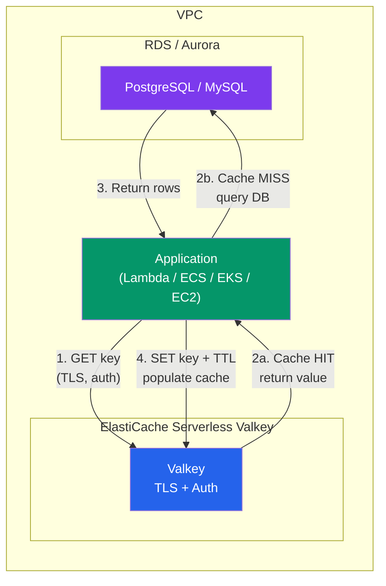
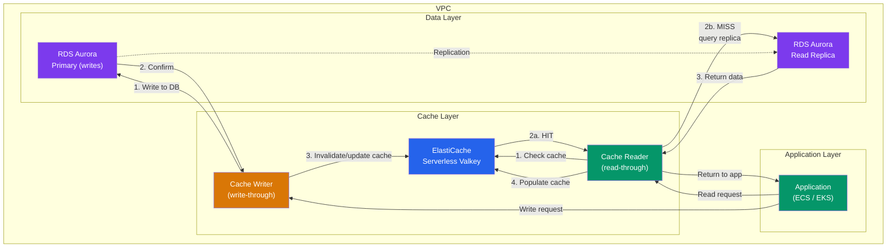
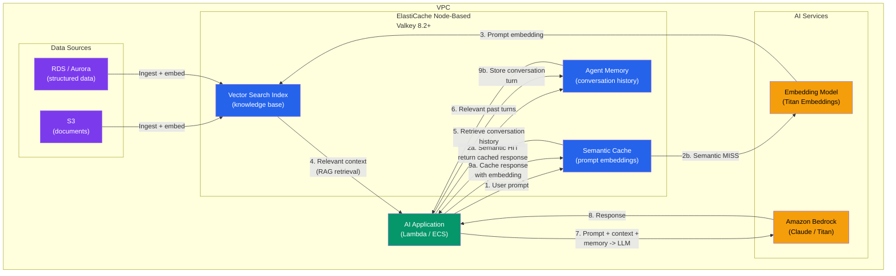
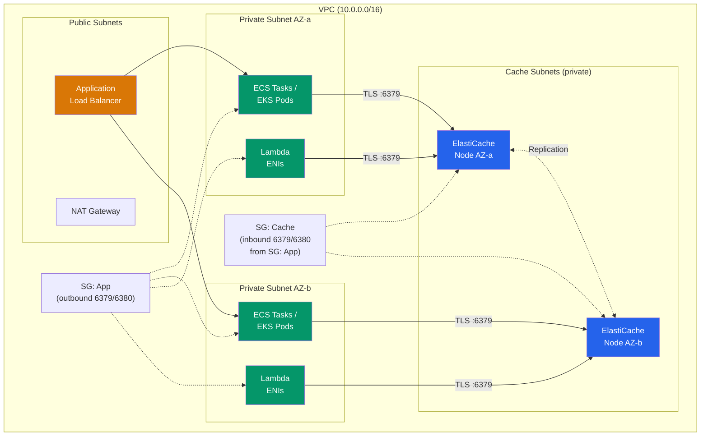

# Architecture Diagrams

Mermaid diagrams for common ElastiCache deployment patterns.

---

## 1. Default Application Caching (Cache-Aside Pattern)

Standard cache-aside pattern with ElastiCache Serverless Valkey in front of a relational database. The application checks the cache first; on a miss, it queries the database and populates the cache.

**Key characteristics:**

- Serverless Valkey is the default cache layer (deploys in under a minute)
- TLS is always on for all serverless caches (Valkey, Redis OSS, and Memcached)
- Application handles cache-miss logic (lazy loading)
- TTL controls staleness tolerance
- Write-through on database updates for active invalidation (optional)

---

## 2. RDS/Aurora Read Acceleration

ElastiCache sits between the application and the database, accelerating reads with optional write-through invalidation.

**Key characteristics:**

- Reads go through cache first (significantly faster than direct DB queries; per AWS published benchmarks, results vary by workload)
- Writes go to the database primary, then invalidate or update the cache
- Aurora read replicas handle cache misses and complex queries
- Reduces Aurora read replica load and RDS costs significantly (per AWS published benchmarks, results vary by workload)
- TTL prevents stale data from persisting if invalidation fails

---

## 3. AI/GenAI Architecture (Semantic Cache + Vector Search)

ElastiCache Valkey 8.2 or above (node-based) provides semantic caching and vector search for LLM applications, reducing Bedrock inference costs and latency.

**Key characteristics:**

- **Semantic cache**: Stores prompt embeddings and LLM responses. On a new prompt, computes embedding similarity to find cached answers. Significantly reduces inference cost and latency (per AWS published benchmarks, results vary by workload).
- **Vector search**: Stores document chunk embeddings for RAG. Retrieves semantically relevant context to ground LLM responses and reduce hallucinations.
- **Agent memory**: Stores conversation turns as vectors. Retrieves only relevant past interactions per LLM invocation to avoid context window overflow.
- **Deployment**: Requires node-based Valkey 8.2 or above (recommend 9.0; vector search is not available on serverless or on data tiering instances such as r6gd node types).
- **Data flow**: Documents are embedded and stored during ingestion. At query time, the embedding model converts the prompt to a vector, which is used for both semantic cache lookup and RAG retrieval.

---

## 4. Network Architecture (VPC Layout)

Common VPC layout showing how ElastiCache integrates with compute resources and security boundaries.

**Key characteristics:**

- ElastiCache runs in private subnets only (no public internet access)
- Security groups restrict inbound to port 6379 (and 6380 for serverless reader endpoint) from the app security group
- Multi-AZ deployment with nodes/endpoints in at least 2 availability zones
- Lambda requires VPC attachment and ENI capacity in the private subnets
- For local development, use SSM port forwarding or a jump host (no direct access)
