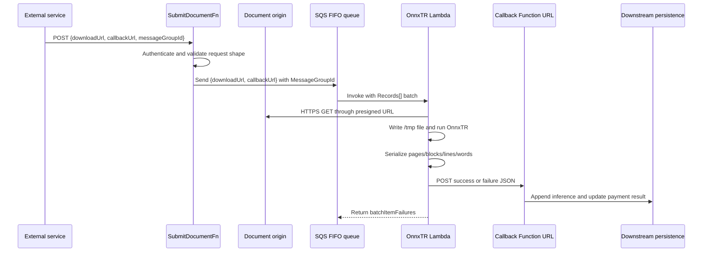

# OnnxTR Lambda Review and Specification

| Metadata | Value |
| --- | --- |
| System | `packages/onnxtr-lambda` |
| Status | Production |
| Review date | 2026-07-17 |
| Document status | Production snapshot, hardening target, and repository implementation pending deployment |
| Target compatibility | Keep the required `downloadUrl` and `callbackUrl` message fields unchanged |

## Executive summary

`onnxtr-lambda` is a CPU-based OCR worker for phone screenshots and other supported images. An Amazon SQS FIFO event provides a presigned document URL and an HTTP callback URL. The Lambda downloads the document, runs an OnnxTR detector/recognizer pair, serializes the complete OCR hierarchy, and posts the result to the callback.

The core OCR implementation is compact and has several sound characteristics: model files are baked into the container, the initialized predictor is reused across warm invocations, temporary files are cleaned up, TLS certificate verification remains enabled, and the result preserves word-level geometry and confidence.

The production review also found four critical issues:

1. The handler returns `batchItemFailures`, but the event-source mapping does not enable `ReportBatchItemFailures`. A caught record failure can therefore be treated as a successful batch and deleted from SQS.
2. Both outbound HTTP destinations come directly from message data without validation, creating a server-side request forgery (SSRF) boundary.
3. Full presigned S3 URLs are logged even though a presigned URL is a temporary access credential.
4. The callback is a public Lambda Function URL with no AWS authentication or application signature.

The target in this document hardens the running design without changing its required message body. It reduces SQS batch size to one, activates partial responses, aligns visibility and retry settings, validates and bounds all network input, signs callbacks, makes callback delivery idempotent, freezes the container build, and defines tests, metrics, alarms, and rollout gates.

## 1. Review basis and methodology

### 1.1 Repository sources

The implementation was traced across the package and its immediate boundaries:

| Source | Role |
| --- | --- |
| [`packages/onnxtr-lambda/handler.py`](../packages/onnxtr-lambda/handler.py) | SQS handler, download, model lifecycle, OCR, serialization, callback, and error handling |
| [`packages/onnxtr-lambda/export_models.py`](../packages/onnxtr-lambda/export_models.py) | Build-time model initialization and cache population |
| [`packages/onnxtr-lambda/Dockerfile`](../packages/onnxtr-lambda/Dockerfile) | Builder and runtime container assembly |
| [`packages/onnxtr-lambda/pyproject.toml`](../packages/onnxtr-lambda/pyproject.toml) | Declared Python compatibility and dependencies |
| [`infra/onnxtr.ts`](../infra/onnxtr.ts) | Separate direct-invocation benchmark function; not a production event source |
| [`infra/queue.ts`](../infra/queue.ts) | FIFO source queue, DLQ, and production subscriber definition |
| [`infra/submit.ts`](../infra/submit.ts) | Authenticated submission Function URL and queue permissions |
| [`packages/functions/src/submit-document.ts`](../packages/functions/src/submit-document.ts) | Primary production submission boundary; accepts the externally selected FIFO message group |
| [`packages/functions/src/process-document.ts`](../packages/functions/src/process-document.ts) | Callback consumer boundary |
| [`packages/shared/src/payment.ts`](../packages/shared/src/payment.ts) | TypeScript representation of OnnxTR output |
| [`packages/shared/src/documents.ts`](../packages/shared/src/documents.ts) | Downstream append-to-history persistence behavior |
| [`packages/web/src/lib/server-fns.ts`](../packages/web/src/lib/server-fns.ts) | In-repository web producer path; not the authoritative production submission boundary |
| [`packages/web/src/lib/documents.ts`](../packages/web/src/lib/documents.ts) | One-hour S3 presigned URL generation used by the in-repository web producer path |
| [`packages/scripts/src/onnxtr-extract.ts`](../packages/scripts/src/onnxtr-extract.ts) | Stale direct-invocation client |
| [`packages/scripts/src/onnxtr-benchmark.ts`](../packages/scripts/src/onnxtr-benchmark.ts) | Direct Lambda benchmark harness using a synthetic one-record SQS event |
| [`packages/onnxtr-lambda/tests/test_handler.py`](../packages/onnxtr-lambda/tests/test_handler.py) | Unit and handler-contract regression tests |
| [`README.md`](../README.md) | Existing technology documentation links |
| [`uv.lock`](../uv.lock) | Frozen workspace resolution exported by SST and installed with hashes during the container build |

Line references in this document describe the files as reviewed on 2026-07-17 and may move after edits.

### 1.2 Production inspection

Production inspection was read-only and limited to:

- Lambda function configuration and state.
- The SQS event-source mapping.
- Source queue and DLQ attributes and approximate depth.
- ECR image metadata.
- CloudWatch Lambda metrics.
- Aggregate CloudWatch Logs Insights queries.

No SQS messages were sent, no Lambda was invoked, no callback was called, no payload or OCR text was read, and no AWS resource was modified. Account identifiers, function names, queue URLs, image repository URLs, callback URLs, signatures, secrets, and document identifiers are intentionally omitted from this document.

### 1.3 Evidence limitations

- The CloudWatch log group spans multiple deployments. Its aggregates are operational evidence, not a controlled benchmark.
- CloudWatch `REPORT` records describe invocations; one invocation can process multiple documents.
- Approximate SQS depths are point-in-time values.
- ECR metadata reported an image size but no scan result. That does not prove whether another registry-level scanner exists.
- Review findings describe the repository and production state at the review date, not a guarantee about later deployments.

### 1.4 Repository implementation status

The production observations and severity ratings in this document remain a snapshot of the deployment inspected on 2026-07-17. The following changes are implemented in the repository but were not deployed or exercised against production as part of this task:

| Area | Prepared implementation |
| --- | --- |
| FIFO delivery | Keeps the FIFO source and external ownership of `MessageGroupId`; configures batch size one, partial batch responses, 18-minute visibility, and five receives before DLQ |
| Model startup | Bakes and verifies a detector/recognizer manifest, then constructs both models from explicit local paths so cold startup does not hash the approximately 197.5 MB cache through OnnxTR's URL-download path |
| Downloads | Reuses a Requests session, streams in bounded chunks, enforces a configurable 20 MiB limit, separates connect/read timeouts, disables redirects, and cleans partial files |
| Serialization | Walks the result hierarchy once while producing JSON, full text, confidence totals, page count, and normalized scalar values |
| Privacy and errors | Removes URL logging and public tracebacks, uses timezone-aware UTC timestamps, validates the basic SQS body shape, and stops after the first FIFO record failure |
| Reproducibility | Aligns Python 3.13, installs a frozen hash-checked export of `uv.lock`, pins the base and UV image digests, pins Requests and Pillow, removes unused `boto3`, and uses an exact reviewed OnnxTR commit |
| Benchmarking | Invokes the separate non-production Lambda directly with a synthetic SQS event; it creates no queue and does not alter FIFO groups or the production event source |

Local verification completed for this repository state:

- All 10 package tests pass under the locked environment.
- The final x86-64 image builds successfully and imports the handler.
- A network-disabled container initializes the locally baked predictor in approximately 2.3 seconds in local Docker and completes an OCR smoke test. This is evidence that runtime model download is unnecessary, not an AWS Lambda performance benchmark.
- The built image contains two model files totaling 197,506,608 bytes and is approximately 547 MB locally. ECR compressed size and Lambda runtime measurements can differ.
- Targeted TypeScript checks pass for the queue, benchmark function, and benchmark client.

These controls remain open: URL host/IP validation, image byte and pixel validation, callback signing and idempotency, stable retry/terminal error codes, custom metrics and alarms, container vulnerability policy, and controlled AWS performance/accuracy benchmarks. A finding is not considered closed in production until the corresponding deployment and acceptance checks succeed.

## 2. Purpose and scope

### 2.1 Purpose

The Lambda converts an image into structured OCR output using [OnnxTR](https://github.com/felixdittrich92/OnnxTR), an ONNX-based pipeline compatible with the high-level [docTR](https://mindee.github.io/doctr/) document model.

The workload is optimized for upright phone screenshots:

- CPU inference.
- One image per OCR call in the current producer flow.
- Straight-page assumption.
- Preserved source aspect ratio.
- Page and crop orientation classifiers disabled.
- Detection batch size one.

### 2.2 In scope

- The `packages/onnxtr-lambda` source and image build.
- Runtime and model initialization.
- SQS event and callback payload contracts.
- Download, temporary storage, OCR, and serialization behavior.
- Failure classification, SQS retry behavior, and callback delivery.
- Security, dependency reproducibility, observability, and performance.
- Unit, contract, security, container, integration, and load testing requirements.
- Deployment, monitoring, rollback, and DLQ operations.

### 2.3 Boundary-only coverage

The following components are covered only where they define a Lambda interface or reliability property:

- The SQS producer.
- The callback Lambda Function URL.
- Downstream idempotency and persistence.
- SST infrastructure settings for the Lambda, event-source mapping, source queue, and DLQ.

### 2.4 Out of scope

- Pago Móvil field extraction and scoring.
- UI presentation and workflow behavior.
- A replacement for SQS, S3 presigned URLs, or the callback architecture.
- A redesign of document persistence.
- OCR model retraining or a model-quality comparison with Textract or docTR.

### 2.5 Supported invocation mode

The supported production contract is an Amazon SQS event containing `Records`.

The legacy [`onnxtr-extract.ts`](../packages/scripts/src/onnxtr-extract.ts) client is incompatible with the handler:

- The script invokes the function with `{ "s3Key": "..." }`.
- `lambda_handler` immediately accesses `event["Records"]`.

Direct `{s3Key}` invocation is therefore stale and unsupported. The target state retains SQS as the sole public invocation contract rather than adding a second adapter.

[`infra/onnxtr.ts`](../infra/onnxtr.ts) is retained as an isolated benchmark target. [`onnxtr-benchmark.ts`](../packages/scripts/src/onnxtr-benchmark.ts) invokes it synchronously with the same one-record SQS-shaped event the production handler consumes. This is test-harness behavior only: the benchmark function has no event-source mapping, creates no queue, and does not change or infer `MessageGroupId`.

## 3. Current architecture and data flow



### 3.1 Submission behavior

The primary production entry point is `submit-document.ts:1-65`, exposed by `infra/submit.ts` as a Lambda Function URL. An external service supplies `downloadUrl`, `callbackUrl`, and `messageGroupId`:

1. The submission Lambda checks the `x-api-key` header against the SST-managed secret.
2. Zod validates that all three request properties are strings.
3. The Lambda sends only `downloadUrl` and `callbackUrl` in the SQS message body.
4. It passes the externally supplied `messageGroupId` to SQS as `MessageGroupId`.

The FIFO group is therefore transport metadata rather than part of the OnnxTR worker payload. Group selection is intentionally controlled by the external service and must remain outside the OCR Lambda. FIFO ordering is guaranteed within each group, while Lambda concurrency is bounded by the number of active message groups and any configured concurrency limits. AWS documents this relationship in [Configuring scaling behavior for SQS event source mappings](https://docs.aws.amazon.com/lambda/latest/dg/services-sqs-scaling.html). The hard-coded group in the separate in-repository `server-fns.ts` path is not evidence of the primary production traffic pattern and is excluded from capacity conclusions.

### 3.2 Handler behavior

#### Reviewed production baseline

For every record in `event["Records"]`, the reviewed production handler:

1. Parses `record["body"]` as JSON.
2. Reads `downloadUrl` and `callbackUrl` through direct dictionary access.
3. Logs both URLs in full.
4. Downloads the entire response with `requests.get(..., timeout=120)`.
5. Reads the complete body into `resp.content` and writes it to `/tmp`.
6. Builds an OnnxTR `DocumentFile` with `DocumentFile.from_images`.
7. Lazily creates or reuses the global predictor.
8. Serializes the OCR hierarchy.
9. Computes the unweighted mean of non-null word confidences.
10. Posts the success result to the callback with a 30-second timeout.
11. On any exception, posts a traceback as a failure result and appends the SQS message ID to `batchItemFailures`.
12. Removes the temporary file in `finally`.

The current scalar Requests timeout applies to connect and read operations; it is not a wall-clock deadline for the complete download. Requests follows redirects by default. See the [Requests API](https://docs.python-requests.org/en/stable/api/).

#### Prepared repository implementation

The prepared handler retains the event and callback payload shapes but changes the internal processing path:

1. It validates `Records`, the record object, `messageId`, parsed body, and both required string fields before processing.
2. It logs safe event names and message/request correlation fields, never either URL or a callback payload.
3. It reuses a module-level `requests.Session`, disables redirects, and streams downloads to a generated temporary file with a configurable 20 MiB limit.
4. It separates connect and read timeouts and removes a partial temporary file after any download failure.
5. It loads detector and recognizer files from manifest-verified local paths and reuses the global predictor.
6. It performs a single hierarchy walk for serialization, text construction, word-confidence aggregation, and page count.
7. It releases the OnnxTR result and source-document references before posting the callback where possible.
8. It sends a sanitized public failure message rather than a stack trace.
9. After a failed FIFO record, it reports that record and all remaining unprocessed record IDs as failures. The configured batch size of one makes this a defensive behavior rather than a normal multi-record path.

Redirect rejection and bounded streaming are implemented. Complete SSRF validation and trusted image decoding are still required by sections 8.3 and 8.4.

### 3.3 Cold and warm execution

#### Reviewed production image build

`export_models.py` sets `ONNXTR_MULTIPROCESSING_DISABLE=TRUE`, constructs the same detector/recognizer pair used at runtime, and causes model files to be populated beneath `/opt/onnxtr_cache`.

The final image copies:

- Python dependencies from the builder stage.
- `/opt/onnxtr_cache` from the builder stage.
- `handler.py` into the Lambda task root.

#### Reviewed production cold invocation

The first call to `get_model()` in an execution environment:

1. Checks for `/opt/onnxtr_cache`.
2. Creates `/tmp/onnxtr_cache` as a symlink to that cache when the `/tmp` path is absent.
3. Enumerates the complete cache for logging.
4. Imports `onnxtr.models.ocr_predictor`.
5. Initializes the predictor.
6. Stores it in the module-global `_model`.

The import and predictor construction happen during the first invocation rather than module initialization, so their duration is included in the first record's `inferenceTimeMs`.

#### Prepared build and cold invocation

The prepared image build initializes `db_resnet50` and `parseq`, locates their exact model files, verifies each filename hash prefix, computes a chunked SHA-256 digest and size, and writes `model-manifest.json` beneath `/opt/onnxtr_cache`. The build fails if either required artifact is absent or inconsistent.

At cold invocation, the handler validates the manifest structure and local file sizes, then passes explicit model objects created with the local `model_path` values to `ocr_predictor`. It does not create a `/tmp` cache symlink, enumerate model names, or invoke OnnxTR's URL-download helper. Runtime SHA-256 recomputation is deliberately omitted because the immutable image build verified the digest; this removes a full read of both model files from the cold path. Missing or malformed artifacts fail locally rather than initiating network access.

#### Warm invocation

`_model` remains populated while Lambda reuses the execution environment. `/tmp` also persists across warm invocations, although the implementation removes each source document after use. Lambda execution-environment reuse is an optimization, not a lifecycle guarantee; see [AWS Lambda best practices](https://docs.aws.amazon.com/lambda/latest/dg/best-practices.html).

## 4. Technology inventory

| Concern | Current repository declaration | Effective/reviewed production state | Assessment |
| --- | --- | --- | --- |
| Deployment format | `python.container: true` | Lambda container image | Appropriate for native and large OCR dependencies |
| Architecture | Not explicitly set | x86-64 | Must match the built ONNX/OpenCV wheels |
| Python | Docker Python 3.13 image pinned by digest | Python 3.13 inside reviewed production image | Aligned in prepared repository; pending deployment |
| SST runtime | `python3.13` | Lambda `Runtime` is unset for image functions | Aligned with image and local tooling |
| Package Python | `>=3.13,<3.14` | Reviewed image used 3.13 | Exact minor line enforced by the lock resolution |
| OnnxTR | Exact archive at commit `52d61362885033b0d026f232efcc3cbea9d23052` (`0.8.2a0`) | Reviewed production preceded this pin | Includes reviewed crop-padding and point-ordering fixes; pending deployment |
| ONNX Runtime | Transitive CPU dependency from `uv.lock` | Reviewed production build was independent of the lock | Frozen and hash-checked in prepared build; still requires scanning |
| HTTP client | `requests==2.34.2` | Installed in reviewed production image | Exact direct version plus transitive hashes |
| Image library | `pillow==12.2.0` | Installed in reviewed production image | Still not used for trusted image validation |
| AWS SDK | Removed from package | Was unused by the reviewed handler | Benchmark client uses AWS SDK v3 in its TypeScript package |
| Detector | `db_resnet50` | `db_resnet50` | Fixed in code and build export |
| Recognizer | `parseq` | `parseq` | Fixed in code and build export |
| Page assumption | Straight | `assume_straight_pages=True` | Appropriate for reviewed phone screenshots |
| Aspect ratio | Preserved | `preserve_aspect_ratio=True` | Avoids phone screenshot distortion |
| Orientation | Disabled | Page and crop classifiers disabled | Faster, but rotated inputs are unsupported |
| Detection batch | 1 | `det_bs=1` | Matches one-document inference |
| Lambda memory | 2,048 MB | 2,048 MB | Provides slightly more than one vCPU allocation |
| Subscriber timeout | 180 seconds | 180 seconds | Applies to the complete SQS batch |
| Ephemeral storage | Not explicitly set | 512 MB default | Shared by source file and warm `/tmp` content |
| Image size | Not constrained | Approximately 517 MiB in ECR | Large but valid for Lambda container deployment |

AWS requires Lambda container images to operate with a read-only root filesystem and provides writable `/tmp` storage from 512 MB to 10,240 MB. See [AWS container image requirements](https://docs.aws.amazon.com/lambda/latest/dg/images-create.html).

### 4.1 Model configuration

The reviewed production predictor was created from architecture names. The prepared runtime resolves the same architectures to explicit baked model paths first:

```python
detector = db_resnet50(model_path=str(detector_path))
recognizer = parseq(model_path=str(recognizer_path))

ocr_predictor(
    det_arch=detector,
    reco_arch=recognizer,
    assume_straight_pages=True,
    preserve_aspect_ratio=True,
    disable_page_orientation=True,
    disable_crop_orientation=True,
    det_bs=1,
    reco_bs=512,
)
```

OnnxTR documents image loading, straight-page behavior, orientation controls, supported architectures, and the `ONNXTR_` environment-variable prefix in its [official repository](https://github.com/felixdittrich92/OnnxTR).

### 4.2 Reproducibility gap and prepared resolution

The reviewed production build installed broad dependency constraints with mutable UV and Lambda base-image tags and did not consume `uv.lock`. Two builds from the same commit could therefore differ.

The prepared Dockerfile pins the UV and AWS Lambda base images by tag and digest. SST exports the committed `uv.lock` for the `onnxtr-lambda` package, and `uv pip install --require-hashes` installs that exact resolution. Direct dependencies are exact, OnnxTR is an immutable commit archive with a locked source hash, and the build-generated model manifest records exact artifact hashes and sizes.

The remaining release controls are an SBOM, dependency/image scanning, a digest-update process, and a clean-build reproducibility check. A Docker image is not guaranteed to be byte-for-byte identical merely because Python packages and parent images are pinned; timestamps and model-host responses must also be controlled or compared through an approved inventory rather than a raw image digest alone.

### 4.3 Upstream code audit and optimization decisions

The optimization review used the exact pinned OnnxTR source, rather than assuming docTR and OnnxTR have identical runtime internals:

| Upstream behavior | Decision |
| --- | --- |
| [`Engine`](https://github.com/felixdittrich92/OnnxTR/blob/52d61362885033b0d026f232efcc3cbea9d23052/onnxtr/models/engine.py) calls `download_from_url` for an HTTP model value but accepts a local filesystem value directly | Construct detector and recognizer objects from manifest-controlled local paths before building the OCR predictor; implemented |
| [`download_from_url`](https://github.com/felixdittrich92/OnnxTR/blob/52d61362885033b0d026f232efcc3cbea9d23052/onnxtr/utils/data.py) verifies an existing cached artifact by reading it into memory and hashing it | Verify model SHA-256 during the image build and check immutable-image file sizes at runtime; implemented, removing repeated cold-start reads |
| [`ocr_predictor`](https://github.com/felixdittrich92/OnnxTR/blob/52d61362885033b0d026f232efcc3cbea9d23052/onnxtr/models/zoo.py) accepts model objects and defaults recognition batching to 512 | Keep 512 as the compatibility default and expose `ONNXTR_RECO_BATCH_SIZE` only for controlled benchmarks; do not claim a gain from the unchanged default |
| [`EngineConfig`](https://github.com/felixdittrich92/OnnxTR/blob/52d61362885033b0d026f232efcc3cbea9d23052/onnxtr/models/engine.py) already enables the CPU arena and all graph optimizations, uses sequential execution, and leaves ONNX Runtime thread counts automatic | Do not override ONNX Runtime session/thread settings without Lambda measurements; a custom `SessionOptions` must reproduce every desired default explicitly |
| OnnxTR supports `load_in_8_bit`, alternative detector/recognizer architectures, and advanced execution providers | Treat quantization, OpenVINO, and model substitution as accuracy/performance experiments, not safe in-place optimizations; benchmark against the fixed corpus before changing production output |
| [`multithread_exec`](https://github.com/felixdittrich92/OnnxTR/blob/52d61362885033b0d026f232efcc3cbea9d23052/onnxtr/utils/multithreading.py) specifically documents Lambda `/dev/shm` constraints | Retain `ONNXTR_MULTIPROCESSING_DISABLE=TRUE` |
| [`DocumentFile.from_images`](https://github.com/felixdittrich92/OnnxTR/blob/52d61362885033b0d026f232efcc3cbea9d23052/onnxtr/io/reader.py) decodes one supplied path into a NumPy page | Keep path-based decode and delete the file in `finally`; add trusted format/pixel validation before relying on OpenCV for security classification |

The package is pinned to [commit `52d6136`](https://github.com/felixdittrich92/OnnxTR/commit/52d61362885033b0d026f232efcc3cbea9d23052), which includes upstream fixes for crop indexing and padded detection score handling after the reviewed 0.8.1 release. The network-disabled smoke test confirms that the prepared local-path loader needs no model download. It does not establish that the chosen model pair, batch setting, thread count, memory tier, or full- versus 8-bit precision is optimal on Lambda.

The next performance matrix should therefore vary one factor at a time through direct invocation: Lambda memory/vCPU tier, full versus supported 8-bit artifacts, detector/recognizer pair, `reco_bs`, and explicit ONNX Runtime thread settings. Every candidate must pass the same OCR token/geometry fixtures and peak-memory thresholds. Upstream benchmark numbers are directional only because their hardware, datasets, model pair, and runtime settings differ from this Lambda workload.

## 5. Current public interfaces

### 5.1 SQS event envelope

Only these SQS fields are consumed:

| JSON path | Type | Use |
| --- | --- | --- |
| `Records` | array | Iterated sequentially |
| `Records[].body` | string | Parsed as the application message |
| `Records[].messageId` | string | Returned for a failed record |

The handler does not validate `eventSource`, queue ARN, AWS region, receipt handle, attributes, or message attributes.

### 5.2 Application message

The required message body is:

```json
{
  "downloadUrl": "https://example.invalid/presigned-object",
  "callbackUrl": "https://example.invalid/documents/<document-uuid>"
}
```

Current JSON Schema, describing what the handler actually expects:

```json
{
  "$schema": "https://json-schema.org/draft/2020-12/schema",
  "$id": "https://textract-testing.invalid/schemas/onnxtr-sqs-message-v1.json",
  "title": "OnnxTR SQS message v1",
  "type": "object",
  "required": ["downloadUrl", "callbackUrl"],
  "properties": {
    "downloadUrl": { "type": "string" },
    "callbackUrl": { "type": "string" }
  },
  "additionalProperties": true
}
```

The reviewed production validation consisted only of `json.loads` and direct dictionary lookup. The prepared handler now requires an object and non-empty string values, but it still does not enforce URL syntax, schemes, destinations, ports, callback path, or maximum field lengths.

The target retains both required fields and `additionalProperties: true` for compatibility, while adding the validation rules in section 8.

The upstream submission API also requires `messageGroupId`, but that value is assigned to the SQS `MessageGroupId` field and is deliberately absent from this application message. The OCR handler must not derive, override, or otherwise reinterpret it.

### 5.3 Successful callback

Representative payload:

```json
{
  "success": true,
  "inferenceType": "onnxtr",
  "extractedAt": "2026-07-17T12:34:56.789Z",
  "pageCount": 1,
  "pages": [
    {
      "page_idx": 0,
      "dimensions": { "height": 1280, "width": 591 },
      "orientation": { "value": null, "confidence": null },
      "language": { "value": null, "confidence": null },
      "blocks": [
        {
          "text": "Operación exitosa",
          "objectness_score": 0.98,
          "geometry": [0.1, 0.2, 0.8, 0.3],
          "lines": [
            {
              "text": "Operación exitosa",
              "geometry": [0.1, 0.2, 0.8, 0.3],
              "objectness_score": 0.98,
              "words": [
                {
                  "text": "Operación",
                  "confidence": 0.97,
                  "geometry": [0.1, 0.2, 0.4, 0.3],
                  "objectness_score": 0.99,
                  "crop_orientation": {
                    "value": null,
                    "confidence": null
                  }
                }
              ]
            }
          ],
          "artefacts": []
        }
      ],
      "text": "Operación exitosa"
    }
  ],
  "fullText": "Operación exitosa",
  "averageConfidence": 0.97,
  "inferenceTimeMs": 38442,
  "modelInfo": {
    "detArch": "db_resnet50",
    "recoArch": "parseq"
  }
}
```

The example is synthetic and contains no production OCR data.

#### Top-level fields

| Field | Type | Nullability | Semantics |
| --- | --- | --- | --- |
| `success` | `true` | Never | Discriminator used by the callback handler |
| `inferenceType` | `"onnxtr"` | Never | OCR engine discriminator |
| `extractedAt` | RFC 3339 string | Never | UTC completion timestamp generated before callback delivery |
| `pageCount` | integer | Never | `pages.length` |
| `pages` | `OnnxTRPage[]` | Never | Complete OCR hierarchy |
| `fullText` | string | Never | Page texts joined with `\n` |
| `averageConfidence` | number | Nullable | Arithmetic mean of all non-null word confidences |
| `inferenceTimeMs` | integer | Never | Current elapsed time from before download through OCR serialization preparation |
| `modelInfo` | object | Never | Detector and recognizer architecture names |

`inferenceTimeMs` is not currently an OCR-only measurement. On a cold environment it includes document download, cache preparation, OnnxTR import, predictor construction, and OCR. It excludes the success callback request because it is calculated before the callback.

#### Geometry

Every geometry is emitted as:

```text
[xMin, yMin, xMax, yMax]
```

The values are normalized coordinates supplied by OnnxTR. Consumers must not interpret them as source pixels. Pixel dimensions are available separately on each page.

#### Nested types

```typescript
type Geometry = [number, number, number, number];

type Orientation = {
  value: number | null;
  confidence: number | null;
};

type Language = {
  value: string | null;
  confidence: number | null;
};

type OnnxTRWord = {
  text: string;
  confidence: number;
  geometry: Geometry;
  objectness_score: number;
  crop_orientation: Orientation;
};

type OnnxTRLine = {
  text: string;
  geometry: Geometry;
  objectness_score: number;
  words: OnnxTRWord[];
};

type OnnxTRArtefact = {
  type: string;
  confidence: number;
  geometry: Geometry;
};

type OnnxTRBlock = {
  text: string;
  objectness_score: number;
  geometry: Geometry;
  lines: OnnxTRLine[];
  artefacts: OnnxTRArtefact[];
};

type OnnxTRPage = {
  page_idx: number;
  dimensions: { height: number; width: number };
  orientation: Orientation;
  language: Language;
  blocks: OnnxTRBlock[];
  text: string;
};
```

Line text joins word values with a space. Block text joins line text with a space. Page text joins block text with a space. `fullText` joins page text with a newline.

#### Type mismatch

The runtime success payload contains `success: true`, but `OnnxTRRawInference` in `payment.ts:73-85` omits `success`. The callback casts the payload to `OnnxTRRawInference` without runtime validation. The target contract requires the shared type and runtime validator to include the discriminator.

### 5.4 Failed callback

Reviewed production payload:

```json
{
  "success": false,
  "error": "Traceback (most recent call last): ..."
}
```

The reviewed production behavior exposed the complete Python traceback to the callback. The prepared handler keeps the two required fields and sends `"Document processing failed."`; the target keeps that public surface sanitized and makes internal classification stable. It may add an optional `errorCode` in a future backwards-compatible revision, but this document does not require a new payload field.

Target example:

```json
{
  "success": false,
  "error": "The document could not be decoded as a supported image."
}
```

Internal stack traces belong only in restricted CloudWatch logs and must be correlated by SQS message ID and Lambda request ID.

### 5.5 Callback HTTP semantics

Reviewed production behavior:

- Method: `POST`.
- Content type: `application/json`.
- Success: any status accepted by `requests.Response.raise_for_status`, normally 2xx/3xx after redirects.
- Timeout: scalar 30 seconds.
- Response body: ignored.
- Authentication: none.
- Redirects: followed by default.

The target HTTP semantics are defined in section 8.5.

The prepared client already separates connect/read timeouts and rejects redirects for both requests. Callback authentication, exact-body signing, idempotency headers, response-size bounds, and retry classification remain target requirements.

### 5.6 SQS handler response

```json
{
  "batchItemFailures": [
    { "itemIdentifier": "sqs-message-id" }
  ]
}
```

An empty list means the invocation processed every record successfully. A populated list is meaningful only when the event-source mapping enables `ReportBatchItemFailures`. See [AWS SQS partial batch responses](https://docs.aws.amazon.com/lambda/latest/dg/services-sqs-errorhandling.html) and the [SST Queue `partialResponses` option](https://sst.dev/docs/component/aws/queue/).

## 6. Sanitized production snapshot

Snapshot date: **2026-07-17**.

### 6.1 Deployed configuration

| Property | Observed production value |
| --- | --- |
| Subscriber deployment | Lambda container image |
| Architecture | x86-64 |
| Memory | 2,048 MB |
| Timeout | 180 seconds |
| Ephemeral storage | 512 MB |
| Lambda state | Active; last update successful |
| Platform log format | Text |
| Source queue | FIFO with content-based deduplication |
| Event-source state | Enabled |
| Batch size | 10 |
| Maximum batching window | 0 seconds |
| Function response types | Empty; no `ReportBatchItemFailures` |
| Queue visibility timeout | 240 seconds |
| DLQ max receive count | 3 |
| Source queue depth | 0 visible, 0 in flight, 0 delayed at inspection |
| DLQ depth | 0 visible, 0 in flight, 0 delayed at inspection |
| ECR image size | 542,264,619 bytes, approximately 517 MiB |
| ECR scan summary | No scan status or findings summary present on the inspected image metadata |
| Separate direct function | Container image; inactive at inspection |
| Callback Function URL | `AuthType: NONE`, buffered, permissive CORS |

AWS documents that a Function URL using `NONE` does not perform IAM authentication and is publicly invokable when its resource policy grants public access. See [Control access to Lambda Function URLs](https://docs.aws.amazon.com/lambda/latest/dg/urls-auth.html).

### 6.2 Aggregate CloudWatch evidence

The inspected log range covered 2026-06-20 through the review time on 2026-07-17.

| Observation | Aggregate |
| --- | ---: |
| Lambda `REPORT` records | 248 |
| `Document processed` application events | 299 |
| `Model init timing` events | 13 |
| `Document processing failed` events | 4 |
| HTTP-related application failures | 3 |
| OS-level application failures | 1 |
| Average invocation duration | approximately 38.4 seconds |
| p95 invocation duration | approximately 88.8 seconds |
| Maximum invocation duration | approximately 100.0 seconds |
| Average per-invocation maximum memory | approximately 336 MB |
| Highest observed maximum memory | approximately 1,595 MB |

Historical logs also contained repeated `Runtime.ImportModuleError` entries for a missing `requests` module before the container-based deployment was corrected on 2026-06-25. Those entries are historical deployment evidence, not evidence that the currently active image lacks Requests.

The 299 processed-document events exceeding 248 invocation reports is consistent with batched SQS invocations. The duration and memory values span versions and traffic shapes; they establish a regression baseline but not a service-level objective.

## 7. Review findings

### 7.1 Summary

Severity is assigned to the inspected production deployment, not merely to the current working tree. The prepared repository state addresses C1, C3, H1-H3, the byte-streaming portion of H5, H7-H10, L1-L4, and part of M1/M2. Those findings remain open operationally until deployment and acceptance. C2, C4, H4, H6, M3-M5, image/pixel validation, and the full observability target still require implementation.

| ID | Severity | Finding | Primary impact | Target control |
| --- | --- | --- | --- | --- |
| C1 | Critical | Partial SQS response is not enabled | Failed documents may be deleted instead of retried | Batch size 1 and `partialResponses: true` |
| C2 | Critical | Message controls both outbound URLs | SSRF and unintended network access | Strict scheme, host, IP, port, path, and redirect validation |
| C3 | Critical | Full presigned URLs are logged | Temporary S3 credential exposure | Never log URLs or query strings |
| C4 | Critical | Callback is public and unsigned | Forged inference writes and cost abuse | HMAC signature, freshness, and idempotency verification |
| H1 | High | Visibility is 240s for a 180s function | Premature duplicate processing during retries/throttles | Visibility at least 1,080s |
| H2 | High | Batch size 10 with sequential OCR | Batch timeout and broad failure blast radius | Batch size 1 |
| H3 | High | FIFO loop continues after failure | Ordering violation after partial-response activation | Size 1; otherwise stop after first failure |
| H4 | High | A presigned URL can expire before processing or retry | Backlog/retry can make the document permanently unavailable | TTL-aware queue-age alarm and explicit 403 terminal handling |
| H5 | High | Entire download is buffered without a cap | Memory and `/tmp` exhaustion | Stream with a 20 MiB hard limit |
| H6 | High | Callback retry repeats OCR; consumer appends | Duplicate history and avoidable compute | Message-ID idempotency key and callback deduplication |
| H7 | High | Callback receives full traceback | Internal detail disclosure | Sanitized public errors |
| H8 | High | `callback_url` may be unbound | Secondary error obscures the original malformed message | Parse/validate before the processing try block |
| H9 | High | Python declarations disagree | Local/prod drift and native wheel mismatch | Pin Python 3.13 everywhere |
| H10 | High | Docker build ignores lockfile | Non-reproducible and unreviewed dependency changes | Frozen lockfile build and pinned image digests |
| H11 | High | Legacy `{s3Key}` direct invocation contract is stale | Broken operational script | Keep SQS-only production; retire the legacy client and use SQS-shaped direct events only for benchmarks |
| M1 | Medium | Reviewed package had no tests | Regressions reach production undetected | Initial tests prepared; complete the matrix in section 10 |
| M2 | Medium | No safe correlation or custom metrics | Slow incident isolation | Structured logs, EMF metrics, alarms |
| M3 | Medium | URL path determines filename/type | Misclassification and unsafe resource use | Generate filename and verify image bytes |
| M4 | Medium | Errors have no retry classification | Poison retries or silent terminal failures | Stable terminal/retryable taxonomy |
| M5 | Medium | Result has no schema version | Future evolution is ambiguous | Preserve v1 and plan optional version field separately |
| L1 | Low | `datetime.utcnow()` is naive/deprecated | Timestamp maintenance issue | Timezone-aware UTC |
| L2 | Low | Cache log enumerates every filename | Noisy logs and image metadata exposure | Counts, sizes, and required-model checks only |
| L3 | Low | `boto3` is unused | Metadata/image drift | Remove or use explicitly |
| L4 | Low | Docker cache steps are redundant/fragile | Harder maintenance | Deterministic cache validation step |

### 7.2 Critical findings

#### C1. Partial SQS failures are ignored

`handler.py:125-127,218,227` catches record failures and returns their message IDs. `infra/queue.ts:17-27` does not set `batch.partialResponses`, and the deployed event source has an empty `FunctionResponseTypes` list.

Without `ReportBatchItemFailures`, Lambda sees a normally returned handler response as a successful invocation and deletes the batch. The JSON response body does not independently trigger a retry. This creates a direct data-loss path for every exception caught inside the record loop.

Target: configure `batch.size: 1` and `batch.partialResponses: true`, verify the deployed mapping contains `ReportBatchItemFailures`, and integration-test a forced retry. AWS explains the required setting in [Handling errors for an SQS event source](https://docs.aws.amazon.com/lambda/latest/dg/services-sqs-errorhandling.html).

Prepared status: `infra/queue.ts` configures both values. Production verification and a forced retry test are still required.

#### C2. Arbitrary outbound URLs create an SSRF boundary

`downloadUrl` is passed to `requests.get`, and `callbackUrl` is passed to `requests.post`. Neither is validated. Requests follows redirects by default.

Although the primary submission boundary requires an API key, the OCR Lambda's security boundary is still the SQS message. A compromised submission credential, another authorized producer, replay tooling, or a malformed operational message can make the function contact arbitrary public or internal destinations.

Target: the validation controls in section 8.3. The [OWASP SSRF Prevention Cheat Sheet](https://cheatsheetseries.owasp.org/cheatsheets/Server_Side_Request_Forgery_Prevention_Cheat_Sheet.html) recommends strict allowlists where known destinations exist and disabling redirect following to prevent validation bypass.

#### C3. Presigned URLs are logged in full

`handler.py:134-139` logs both URLs. An S3 presigned URL contains an `X-Amz-Signature` and grants the operation for its validity period. AWS recommends treating it as a temporary access credential; see [Logging interactions and mitigations](https://docs.aws.amazon.com/prescriptive-guidance/latest/presigned-url-best-practices/logging-interactions.html).

Target: never record either complete URL, query component, request headers, or callback body. Correlate exclusively with Lambda request ID and SQS message ID.

Prepared status: application logs contain neither URL. Existing historical logs retain their own configured CloudWatch retention and should be handled according to the incident/data-retention policy.

#### C4. Callback is public and unsigned

The callback function is configured with `url: true`. SST defaults Function URL authorization to `none`, and the deployed URL confirms `AuthType: NONE` with permissive CORS. The callback accepts a document ID from its path and a caller-supplied success payload, casts it to `OnnxTRRawInference`, and persists it.

Target: preserve the URL/body contract but sign every request as specified in section 8.5. The callback must reject missing, stale, invalid, or replayed signatures before parsing or writing data.

### 7.3 High findings

#### H1. Visibility timeout is too short

The source queue visibility timeout is 240 seconds and the subscriber timeout is 180 seconds. AWS recommends visibility of at least six times the function timeout to leave room for throttling and retries: 1,080 seconds in this configuration. See [Creating and configuring an SQS event source mapping](https://docs.aws.amazon.com/lambda/latest/dg/services-sqs-configure.html).

Prepared status: the FIFO queue visibility is 18 minutes and redrive occurs after five receives. A DLQ alarm is still required.

#### H2. A ten-record batch cannot be bounded safely

The handler processes records sequentially. Production p95 invocation duration was approximately 88.8 seconds, and the maximum was approximately 100 seconds, while the total batch timeout is 180 seconds. A ten-record batch has no defensible worst-case budget when each record may spend up to 120 seconds downloading, initialize the model, run OCR, and spend 30 seconds on callback delivery.

Target: one record per invocation. Model reuse still occurs across warm invocations without coupling ten documents to one timeout.

Prepared status: batch size one is configured while the FIFO queue and external `MessageGroupId` policy remain unchanged.

#### H3. FIFO processing continues after a record failure

The loop appends a failure and continues to later records. When partial responses are enabled for a FIFO queue, AWS says to stop after the first failure and return all failed and unprocessed records to preserve ordering. Batch size one makes this requirement automatic.

Prepared status: the handler stops at the first failure and reports every remaining record as unprocessed; batch size one is the configured normal path.

#### H4. Presigned URL lifetime and queue lifetime can differ

The primary submission Lambda accepts an externally generated `downloadUrl` and does not receive its expiry time or provide a refresh mechanism. The separate in-repository web producer creates a 3,600-second URL, but that value is not assumed to describe the external production service. In either path, the queue can retain messages beyond a finite URL lifetime, a backlog can delay first processing, and retries occur later. S3 also limits presigned URL validity to the underlying credential lifetime. See [Download and upload objects with presigned URLs](https://docs.aws.amazon.com/AmazonS3/latest/userguide/using-presigned-url.html).

The selected target intentionally preserves this URL contract. It must therefore treat HTTP 401/403/404 as terminal, make the external URL TTL an explicit operational configuration, and alert on queue age before that configured TTL. An AWS-native bucket/key contract would remove this risk but is outside this target.

#### H5. Download has no resource bound

`requests.get` uses the default `stream=False`, so the complete object is buffered as `resp.content` before it is written. There is no `Content-Length`, byte-count, MIME, image-format, or pixel-count limit.

Target: section 8.4. Requests documents that `stream=True` plus `iter_content` avoids reading a large response into memory at once.

Prepared status: streaming, `Content-Length` precheck, streamed-byte enforcement, and partial-file cleanup are implemented with a default 20 MiB limit. MIME, decoded format, and pixel-count validation remain open.

#### H6. Callback retries are not idempotent

Any callback failure is handled as a document failure, which will repeat download and OCR once SQS retries work. The downstream `saveInference` uses `list_append`, so repeated successful callbacks append duplicate inference records.

Target: send `X-OnnxTR-Idempotency-Key` equal to the SQS message ID. The callback must retain completed keys for at least five days—the current four-day queue retention plus a safety day—and return the original acknowledgement without a second write.

#### H7. Tracebacks cross the trust boundary

The current `error` field contains `traceback.format_exc()`. Exceptions can include library paths, internal implementation details, hostnames, and signed URLs.

Target: log the traceback internally with safe correlation and send only a stable public message.

Prepared status: callback consumers receive a generic message and logs contain only the exception type. Stable internal codes and restricted stack-trace logging remain open.

#### H8. Error handling can reference an uninitialized callback

`callback_url` is assigned only after body parsing. If JSON parsing or `downloadUrl` lookup fails, the exception handler attempts to use `callback_url`, causing `UnboundLocalError`, which is swallowed. The SQS failure list is still updated, but the secondary error obscures intent and complicates testing.

Target: validate the complete record into a typed value before entering processing; only attempt a failure callback when a validated callback URL exists.

Prepared status: `_parse_record` validates both non-empty strings and `_safe_callback_url` never references an unassigned local. Complete URL validation remains open.

#### H9. Runtime versions drift

- Docker image: Python 3.13.
- SST: Python 3.14.
- `pyproject.toml`: Python 3.11 or newer.

For an image function, the Docker base defines the production interpreter; Lambda reports no managed `Runtime`. SST still uses the declared runtime for local/tooling behavior. The [SST Python container example](https://sst.dev/docs/examples/aws-python-container) recommends aligning local and deployed Python versions.

Target: Python 3.13 in all three locations, with `requires-python = ">=3.13,<3.14"`.

Prepared status: SST, Docker, and package metadata now agree on Python 3.13.

#### H10. Container inputs are mutable

The Dockerfile ignores the workspace lock, uses `uv:latest`, uses an unpinned Lambda base tag, and permits any future OnnxTR version satisfying `>=0.8`.

Target: section 8.8.

Prepared status: the lock export, direct versions, source hash, and both parent image digests are pinned. SBOM/scanning and automated digest refresh remain open.

#### H11. Direct function and script are stale

The legacy direct script sends `{s3Key}` and expects a synchronous OCR payload. The handler expects SQS and returns `batchItemFailures`. The separate direct function was inactive at inspection and carried unused bucket configuration.

Prepared status and target: bucket linkage was removed from the separate function and it is explicitly retained as a benchmark target. The new benchmark client sends a synthetic SQS-shaped event directly through the Lambda Invoke API and creates no queue. Retire the legacy `{s3Key}` client separately; do not add dual event detection to the OCR handler.

### 7.4 Medium and low findings

#### Missing tests

No `test`, `spec`, pytest configuration, fixtures, or package-level smoke tests existed in the reviewed baseline. The prepared repository adds 10 standard-library unit/contract tests covering hierarchy serialization, confidence aggregation, model-manifest validation, global model reuse, bounded streaming cleanup, handler success, and FIFO failure identifiers. Security, representative accuracy, Lambda Runtime Interface Emulator, AWS retry, and controlled performance tests remain open.

#### Observability gaps

Application messages are JSON strings, but Lambda platform logging is text. Logs lack a safe message ID, request ID, cold-start flag, or separate download/OCR/callback timings. There are no documented custom metrics or alarms.

#### Media trust

The temporary filename suffix comes from the URL path, including an empty suffix when the path ends with `/`. The implementation does not verify that bytes match the claimed file type before OnnxTR/OpenCV decoding.

#### Timestamp

`datetime.utcnow().isoformat() + "Z"` creates a naive value and uses an API deprecated in modern Python. The target is `datetime.now(timezone.utc)` serialized with `Z`.

Prepared status: the handler now emits timezone-aware UTC with the existing `Z` wire representation.

#### Cache log volume

Cold initialization recursively lists every cache filename. The target should report only file count, total bytes, required detector/recognizer presence, and timing.

Prepared status: build logs report only model count and total bytes; runtime logs report architecture and timing without paths or filenames.

### 7.5 Positive observations

- The model is stored outside the handler and reused on warm invocations.
- Model artifacts are populated during image build, avoiding an intentional runtime download.
- Detector/recognizer settings are identical in build export and runtime initialization.
- Temporary source files are removed in `finally`.
- HTTPS certificate verification is not disabled.
- Download and callback requests have non-infinite socket timeouts.
- OCR output retains geometry, word confidence, objectness, page dimensions, and model identity.
- The container uses a multi-stage build and does not copy compiler packages into the final stage.
- Average observed maximum memory was well below 2,048 MB, although the observed peak leaves materially less headroom.
- A FIFO source queue and DLQ already exist.

## 8. Production-hardened target

### 8.1 Compatibility invariants

The target must preserve:

- SQS as the invocation mechanism.
- Required message body fields named `downloadUrl` and `callbackUrl`.
- The FIFO source queue and per-group ordering semantics.
- External-service ownership of `MessageGroupId`; the OCR Lambda must remain agnostic to group selection.
- Existing success and failure payload fields.
- `inferenceType: "onnxtr"`.
- The nested page/block/line/word result structure.
- FIFO delivery.

The target may add:

- HTTP authentication/idempotency headers.
- Environment variables.
- Internal error codes and metrics.
- Optional response fields only after consumer compatibility is verified.

### 8.2 Queue and retry semantics

Required SST behavior:

```typescript
documentQueue.subscribe(
  {
    handler: "packages/onnxtr-lambda/handler.lambda_handler",
    runtime: "python3.13",
    python: { container: true },
    timeout: "3 minutes",
    memory: "2048 MB",
    // environment omitted
  },
  {
    batch: {
      size: 1,
      partialResponses: true,
    },
  },
);
```

The exact SST overload must be verified against the installed SST version, but the synthesized event-source mapping must have:

- `BatchSize = 1`.
- `FunctionResponseTypes = ["ReportBatchItemFailures"]`.
- `MaximumBatchingWindowInSeconds = 0`.

Queue requirements:

| Setting | Target |
| --- | ---: |
| Queue type | FIFO |
| Visibility timeout | At least 1,080 seconds |
| DLQ max receive count | At least 5 |
| Batch size | 1 |
| Partial responses | Enabled |
| Function timeout | 180 seconds |

`MessageGroupId` assignment is not changed by this target. The submission Lambda continues forwarding the value selected by the external service, and the OCR event source continues consuming the FIFO queue. Capacity planning must use the real distribution of active message groups rather than assume a single global group.

On success, return an empty `batchItemFailures`. On retryable failure, return exactly the current record's non-empty SQS `messageId`. The handler must never return a failed ID when `messageId` is absent; an invalid AWS envelope must fail the invocation so Lambda retries the complete batch.

### 8.3 URL validation

Both URLs must pass validation before any network operation.

#### Common validation

- Parse with `urllib.parse.urlsplit`.
- Scheme must be exactly `https` after case normalization.
- Hostname must be present and match an exact configured allowlist entry.
- Effective port must be 443; explicit non-443 ports are rejected.
- Username and password must be absent.
- Fragment must be absent.
- URL length must be bounded; target maximum is 8,192 characters.
- Every DNS answer must be checked. Reject loopback, private, link-local, multicast, reserved, unspecified, and non-global IPv4/IPv6 addresses.
- Validation occurs immediately before the request.
- `allow_redirects=False` for downloads and callbacks.
- A redirect is rejected. If redirects are later required, every hop must repeat complete validation before following it.

Exact allowlists are configured through:

- `DOWNLOAD_HOST_ALLOWLIST`: comma-separated exact S3 or approved distribution hostnames.
- `CALLBACK_HOST_ALLOWLIST`: comma-separated exact callback hostnames.

Wildcards, suffix-only checks such as `endswith("amazonaws.com")`, and caller-supplied allowlist additions are prohibited.

The exact host is not logged. Validation failures record only the stable error code and correlation IDs.

#### Download-specific validation

- Query parameters are permitted because S3 signatures require them.
- The query is never logged or copied to an error.
- The host must be in `DOWNLOAD_HOST_ALLOWLIST`.

#### Callback-specific validation

- Query parameters are prohibited.
- Path must match `^/documents/[0-9a-fA-F-]{36}/?$` and the identifier must parse as an RFC 4122 UUID.
- The host must be in `CALLBACK_HOST_ALLOWLIST`.

Host allowlisting is the primary SSRF control; IP classification and redirect rejection are defense in depth.

### 8.4 Bounded document download

Required defaults:

| Setting | Target default |
| --- | ---: |
| `MAX_DOCUMENT_BYTES` | 20,971,520 bytes (20 MiB) |
| Connect timeout | 5 seconds |
| Read timeout | 30 seconds |
| Stream chunk | 1 MiB |
| Supported formats | JPEG and PNG |
| Maximum image pixels | 50,000,000 |

Required flow:

1. Issue `GET` with `stream=True`, `(5, 30)` timeout, TLS verification, and redirects disabled.
2. Classify the HTTP status before reading the body.
3. If `Content-Length` is present, parse it strictly and reject values above `MAX_DOCUMENT_BYTES`.
4. Stream fixed-size chunks to a generated file under `/tmp`, tracking the exact total.
5. Abort and delete the partial file as soon as the total exceeds the maximum.
6. Close the response in a context manager.
7. Verify bytes with Pillow, enforce the pixel limit, and accept only decoded `JPEG` or `PNG`.
8. Reopen or reload the verified document for OCR because Pillow `verify()` invalidates the first image object.
9. Give the temporary file a suffix based on verified format, never URL text.
10. Delete the file in `finally`, including terminal and retryable errors.

`Content-Type` may be used as an early rejection hint but is not trusted as proof of format. `application/octet-stream` can proceed to byte verification.

### 8.5 Callback authentication and idempotency

#### Required headers

| Header | Value |
| --- | --- |
| `Content-Type` | `application/json` |
| `X-OnnxTR-Timestamp` | Unix time in whole UTC seconds |
| `X-OnnxTR-Idempotency-Key` | SQS `messageId` |
| `X-OnnxTR-Signature` | `v1=` followed by lowercase HMAC-SHA256 hex |

#### Canonical signature

Serialize the callback payload once using UTF-8, compact JSON separators, and deterministic key order. Let the exact bytes be `body`.

```text
canonical = timestamp + "." + messageId + "." + body
signature = HMAC-SHA256(secret, canonical)
header = "v1=" + lowercase_hex(signature)
```

The callback must:

1. Read the raw body bytes before parsing.
2. Require all three OnnxTR headers.
3. Reject timestamps more than 300 seconds from callback server time.
4. Recompute the signature over the raw bytes.
5. Compare signatures with a constant-time comparison.
6. Claim the idempotency key atomically before writing inference data.
7. Retain the completed key for at least five days.
8. Return the prior successful acknowledgement for a completed replay without appending another inference.

The signing secret must be stored in an SST-managed secret backed by an appropriate secret store, not a plaintext repository value or ordinary environment variable. An environment variable may contain only the secret identifier. The secret is cached in the execution environment and must support planned rotation with an overlap window.

#### HTTP behavior

- Method: `POST`.
- Redirects: disabled.
- Timeout: `(5, 15)` connect/read tuple.
- Accepted response: 2xx only.
- 3xx: rejected as a configuration/security failure.
- 4xx/5xx: callback delivery failure; the SQS record is retryable unless the callback explicitly provides a documented idempotent acknowledgement.
- Response body: bounded to 64 KiB and not logged.

Callback failure remains retryable because a successful OCR result is not complete until the downstream consumer acknowledges it.

### 8.6 Failure classification

Stable internal codes must drive behavior. Codes are logged and emitted as metric dimensions; public callback text remains sanitized.

| Condition | Code | Classification | Callback | SQS result |
| --- | --- | --- | --- | --- |
| Invalid SQS body JSON | `INVALID_MESSAGE` | Terminal | Only if callback URL was validated | Success after callback acknowledgement; otherwise retry |
| Missing/non-string URL | `INVALID_MESSAGE` | Terminal | If possible | Same as above |
| URL validation failure | `INVALID_URL` | Terminal | Only through a separately validated callback | Success after acknowledgement |
| Download connect/read timeout | `DOWNLOAD_TIMEOUT` | Retryable | No failure callback until terminal policy is reached | Failed item |
| Download connection/TLS failure | `DOWNLOAD_UNAVAILABLE` | Retryable | No | Failed item |
| Download HTTP 408/429/5xx | `DOWNLOAD_UNAVAILABLE` | Retryable | No | Failed item |
| Download HTTP 401/403/404 | `DOWNLOAD_NOT_ACCESSIBLE` | Terminal | Sanitized failure | Success after acknowledgement |
| Document above byte/pixel limit | `DOCUMENT_TOO_LARGE` | Terminal | Sanitized failure | Success after acknowledgement |
| Unsupported/invalid image | `UNSUPPORTED_DOCUMENT` | Terminal | Sanitized failure | Success after acknowledgement |
| Predictor import/init failure | `MODEL_UNAVAILABLE` | Retryable | No | Failed item |
| Document-specific OCR decode error | `OCR_REJECTED_DOCUMENT` | Terminal | Sanitized failure | Success after acknowledgement |
| Unexpected OCR/runtime error | `OCR_INTERNAL_ERROR` | Retryable | No traceback | Failed item |
| Callback timeout/network/HTTP failure | `CALLBACK_UNAVAILABLE` | Retryable | Not applicable | Failed item |
| Internal validation/programming error | `INTERNAL_ERROR` | Retryable | No traceback | Failed item |

If a terminal failure callback cannot be delivered, the record becomes retryable. This guarantees that the source message is not deleted before the document owner can observe its terminal status.

The handler must not sleep between SQS retries. Lambda/SQS backoff and visibility control redelivery.

### 8.7 Model lifecycle

- Keep a single module-global predictor per execution environment.
- Emit separate cache preparation, import, and predictor construction timings.
- Validate at build time that files for both `db_resnet50` and `parseq` exist.
- Runtime initialization must succeed with network access disabled.
- Never silently download a missing model at runtime. Missing cache content is `MODEL_UNAVAILABLE`.
- Retain `ONNXTR_MULTIPROCESSING_DISABLE=TRUE` unless a measured load test justifies a change.
- Preserve the reviewed predictor settings unless an OCR quality evaluation approves a model/configuration revision.
- Do not enumerate cache filenames in production logs.

### 8.8 Reproducible container build

Required controls:

1. Set Python 3.13 in SST.
2. Set `requires-python = ">=3.13,<3.14"`.
3. Use the Python 3.13 Lambda base image by immutable digest.
4. Use a fixed UV version and immutable image digest.
5. Resolve dependencies in the committed workspace `uv.lock`.
6. Install in frozen mode; fail if package metadata and lockfile differ.
7. Pin OnnxTR, Requests, Pillow, and native transitive dependencies through the lockfile.
8. Remove `boto3` if the handler continues not to use it. Otherwise install and lock it explicitly instead of relying on the runtime image's SDK.
9. Build detector and recognizer cache in a network-enabled builder stage.
10. Validate cache content and run an OCR smoke test before producing the final stage.
11. Run the final image as Lambda's default unprivileged user.
12. Generate an SBOM and scan dependencies and the final ECR image.
13. Block critical findings. High findings require a documented exception with owner and expiry.

AWS base images are updated over time and require rebuilding and updating the Lambda to consume a new base. See [Deploy Python Lambda functions with container images](https://docs.aws.amazon.com/lambda/latest/dg/python-image.html). UV frozen/locked behavior is documented in the [UV documentation](https://docs.astral.sh/uv/).

### 8.9 Environment variables

| Variable | Reviewed production | Prepared/target |
| --- | --- | --- |
| `ONNXTR_CACHE_DIR` | `/tmp/onnxtr_cache` | `/opt/onnxtr_cache`; immutable baked models are opened directly |
| `ONNXTR_MODEL_MANIFEST` | Absent | `/opt/onnxtr_cache/model-manifest.json`; implemented |
| `ONNXTR_MULTIPROCESSING_DISABLE` | `TRUE` | Retain |
| `DOWNLOAD_HOST_ALLOWLIST` | Absent | Required exact-host CSV |
| `CALLBACK_HOST_ALLOWLIST` | Absent | Required exact-host CSV |
| `MAX_DOCUMENT_BYTES` | Absent | Optional; default 20 MiB; implemented |
| `ONNXTR_RECO_BATCH_SIZE` | Implicit OnnxTR default | Optional; default 512; benchmark changes before production tuning |
| `MAX_IMAGE_PIXELS` | Absent | Optional; default 50 million |
| `CALLBACK_SIGNING_SECRET_ID` | Absent | Required secret reference, not secret value |
| `LOG_LEVEL` | Absent | Optional; default `INFO` |
| `POWERTOOLS_SERVICE_NAME` | Absent | `onnxtr-ocr` if Powertools is adopted |
| `POWERTOOLS_METRICS_NAMESPACE` | Absent | `TextractTesting` if Powertools is adopted |

Startup must fail with `CONFIGURATION_ERROR` when a required allowlist or secret reference is missing or empty.

### 8.10 Observability

#### Structured events

Use Lambda JSON logging or a structured logger such as [AWS Lambda Powertools](https://docs.powertools.aws.dev/lambda/python/latest/). Do not log the complete input event.

Required application event names:

- `model_init_started`
- `model_init_completed`
- `document_downloaded`
- `document_processed`
- `callback_completed`
- `document_failed`

Common safe fields:

| Field | Notes |
| --- | --- |
| `service` | `onnxtr-ocr` |
| `event` | One of the names above |
| `stage` | Deployment stage |
| `lambdaRequestId` | From Lambda context |
| `sqsMessageId` | Safe correlation/idempotency key |
| `coldStart` | Boolean |
| `attempt` | SQS `ApproximateReceiveCount`, parsed as integer |
| `retryable` | Boolean on failures |
| `errorCode` | Stable internal code |
| Timing fields | Integer milliseconds |
| `documentBytes` | Integer, after bounded download |
| `pageCount` | Integer |
| `wordCount` | Integer |
| `averageConfidence` | Number/null |

Prohibited log content:

- Download or callback URLs.
- URL query strings.
- Presigned signatures or HTTP authorization headers.
- Callback signing secret or signature.
- Raw SQS message body.
- OCR text or callback payload.
- Document ID or callback path.
- Source document bytes.

Internal tracebacks may be recorded only on `ERROR`, with library/application paths accepted but exception messages sanitized to remove URLs before logging.

AWS supports structured application logs and JSON platform logs; see [Configuring JSON and plain text log formats](https://docs.aws.amazon.com/lambda/latest/dg/monitoring-cloudwatchlogs-logformat.html).

#### Metrics

Emit through CloudWatch Embedded Metric Format so metrics do not add a synchronous API call.

| Metric | Unit | Dimensions |
| --- | --- | --- |
| `DocumentsSucceeded` | Count | Stage, service |
| `DocumentsFailed` | Count | Stage, service, errorCode, retryable |
| `DownloadDuration` | Milliseconds | Stage, service |
| `ModelInitDuration` | Milliseconds | Stage, service |
| `OcrDuration` | Milliseconds | Stage, service |
| `CallbackDuration` | Milliseconds | Stage, service |
| `TotalProcessingDuration` | Milliseconds | Stage, service |
| `DocumentBytes` | Bytes | Stage, service |
| `PageCount` | Count | Stage, service |
| `ColdStart` | Count | Stage, service |
| `RetryableFailure` | Count | Stage, service, errorCode |
| `TerminalFailure` | Count | Stage, service, errorCode |

Do not use message ID, document ID, URL host, or exception text as metric dimensions; they create unbounded cardinality.

#### Alarms

| Alarm | Initial threshold |
| --- | --- |
| Lambda errors | Greater than 0 for 5 minutes |
| Throttles | Greater than 0 for 5 minutes |
| Duration p99 | Greater than 144 seconds (80% of timeout) for 5 minutes |
| Retryable failure rate | Greater than 1% over 15 minutes with at least 20 documents |
| Callback failures | Greater than 0 for 5 minutes |
| Queue oldest-message age | Greater than 30 minutes |
| DLQ visible messages | Greater than 0 for 5 minutes |
| Peak memory regression | Greater than 1,800 MB in any invocation |

Thresholds must be revisited after two weeks of clean batch-size-one production data.

## 9. Security requirements

| Area | Requirement |
| --- | --- |
| IAM | Dedicated Lambda execution role; exact SQS/log/secret permissions only |
| Network | No VPC attachment unless required; HTTPS allowlists and SSRF validation |
| Input | Schema, URL, byte, pixel, format, and path validation before OCR |
| Output | Signed callback, freshness check, constant-time comparison, idempotency |
| Secrets | Secret store and cached retrieval; never plaintext repo or logs |
| Logs | No URLs, signatures, raw text, payloads, or document identifiers |
| Image | Immutable base/tool digests, lockfile, SBOM, dependency and ECR scans |
| Files | Generated names, `/tmp` only, bounded writes, `finally` cleanup |
| Errors | Public sanitization and stable internal taxonomy |
| Supply chain | Critical vulnerabilities block release; high findings require expiring exception |

The existing public callback URL should eventually use IAM authentication or move behind an authenticated service boundary. HMAC is the required compatibility control for the current URL contract, not a claim that a public Function URL is the preferred long-term architecture.

## 10. Test and acceptance specification

The items below are the complete acceptance matrix, not a claim that every test exists. The prepared 10-test suite covers the subset identified in section 7.4; unchecked security, container, AWS integration, and performance cases remain release work.

### 10.1 Unit tests

| Area | Required cases |
| --- | --- |
| Geometry | Valid tuple conversion; zero/one boundaries; malformed geometry |
| Word serialization | Text, confidence, geometry, objectness, crop orientation |
| Line serialization | Word order, space joining, empty words |
| Block serialization | Line/artefact order, block text, empty collections |
| Page serialization | Dimensions, page index, orientation, language, page text |
| Full text | One page, multiple pages, empty pages |
| Average confidence | Values, nulls, empty word set |
| Model singleton | First construction once; warm reuse; failed init not cached as success |
| Cache | Valid manifest, malformed/version-mismatched manifest, traversal path, `/opt` missing, required file missing, byte-size mismatch, build hash mismatch |
| Timestamp | Timezone-aware UTC ending in `Z` |
| Error taxonomy | Every exception maps to one stable code and classification |

Pure serialization and validation functions must not import or initialize OnnxTR, allowing fast local tests.

### 10.2 Event and contract tests

- Valid one-record SQS event.
- Empty `Records` array.
- Missing or non-array `Records`.
- More than one record: safe sequential fallback while target infrastructure remains batch size one.
- Missing or empty `messageId`.
- Invalid body JSON.
- Missing, null, numeric, array, and overlength URL values.
- Exact successful callback schema.
- Exact failed callback schema.
- Compatibility with `OnnxTRRawInference` after adding `success: true`.
- Empty and populated `batchItemFailures`.
- Forced record failure is redelivered in an AWS integration test.

### 10.3 Security tests

- `http`, mixed-case schemes, and scheme-relative URLs.
- URLs with usernames/passwords.
- Explicit port 80, alternate HTTPS ports, and malformed ports.
- `localhost`, IPv4 loopback/private/link-local/multicast/reserved ranges.
- IPv6 loopback, unique-local, link-local, multicast, mapped IPv4, and encoded address variants.
- Allowed DNS name returning a prohibited address.
- Redirect from an allowed host to allowed and disallowed hosts; both rejected by the no-redirect policy.
- Callback path outside `/documents/{uuid}` and malformed UUIDs.
- Callback query/fragment rejection.
- Presigned URL/query redaction in success and failure logs.
- Valid callback signature.
- Missing, malformed, wrong-secret, and wrong-body signatures.
- Timestamp older/newer than the five-minute window.
- Replayed idempotency key before, during, and after original processing.
- Constant-time comparison path.
- Oversize body with `Content-Length`.
- Oversize chunked body without `Content-Length`.
- Misleading MIME and extension.
- Invalid, truncated, and decompression-bomb image bytes.

### 10.4 Reliability tests

| Failure | Expected result |
| --- | --- |
| Download connect timeout | Retryable batch failure |
| Download read timeout midway | Partial file removed; retryable failure |
| HTTP 403/404 | Sanitized terminal callback, then SQS success after acknowledgement |
| HTTP 408/429/500 | Retryable batch failure |
| Model cache unavailable | Retryable `MODEL_UNAVAILABLE` |
| OCR rejects valid container but invalid image | Terminal callback |
| Unexpected predictor exception | Retryable internal failure, no public traceback |
| Callback connect/read timeout | Retryable batch failure |
| Callback 3xx/429/500 | Retryable batch failure |
| Callback 2xx replay | No duplicate persistence |
| Terminal callback failure | Record remains retryable |
| Fifth failed delivery | Message moves to DLQ and alarm fires |
| FIFO forced failure | No later same-group message commits first |

Cloud integration tests must run against an isolated SST stage because mocks do not validate the synthesized event-source response type, queue visibility, IAM, redrive, or Function URL behavior.

### 10.5 Container and model tests

- Frozen build from a clean checkout.
- Second build with the same inputs produces the same dependency/model inventory.
- Final image imports `handler`, Requests, Pillow, OnnxTR, and ONNX Runtime.
- Required detector and recognizer files exist in `/opt/onnxtr_cache`.
- Runtime smoke test has outbound network disabled after image build.
- Lambda Runtime Interface Emulator accepts a representative SQS event.
- Representative JPEG and PNG fixtures produce a valid result hierarchy.
- Unsupported formats fail before OnnxTR.
- Final image platform matches the configured Lambda architecture.
- SBOM includes all Python and OS packages.
- Dependency and image scanners pass the release policy.

### 10.6 Performance acceptance

Measure with a fixed, sanitized representative corpus in an AWS non-production stage. Baseline acceptance uses the production-equivalent 2,048 MB, x86-64, 512 MB `/tmp`, batch-size-one configuration.

Invoke the benchmark target synchronously through the Lambda Invoke API; do not create a benchmark queue or event-source mapping. Each invocation supplies a synthetic one-record SQS event matching sections 5.1 and 5.2, including a unique test `messageId`, a sanitized fixture `downloadUrl`, and an isolated test `callbackUrl`. This exercises the production handler path without introducing the stale `{s3Key}` payload as a second contract.

The prepared harness is run from `packages/scripts` with `bun run onnxtr-benchmark` after supplying `BENCHMARK_DOWNLOAD_URL`, `BENCHMARK_CALLBACK_URL`, and optionally `BENCHMARK_RUNS` (1-100) through a secure environment. Pass the intended non-production SST stage to `sst shell` through the script invocation; the harness refuses `SST_STAGE=production`. It prints wall-clock duration and the Lambda `REPORT` line for every run plus min/p50/p95/max/average. It fails on a Lambda function error or a returned batch failure. The callback endpoint must be isolated and idempotent because every benchmark run posts a real result.

Use a dedicated benchmark Lambda when a test varies memory, architecture, model files, ONNX Runtime settings, concurrency, or cold-start strategy. An unchanged non-production control may reuse the approved production container digest. Direct benchmark invocation is test-harness behavior, not a supported production invocation mode, and it must not mutate or invoke the production Lambda, production event source, production queue, or the external service's `MessageGroupId` policy. Queue throughput and FIFO group allocation are outside the performance benchmark; report per-document Lambda duration, stage timings, memory, storage, cost, and OCR accuracy instead.

| Criterion | Acceptance threshold |
| --- | ---: |
| Warm total-processing p95 | At most 90 seconds |
| Cold model initialization plus one document | At most 150 seconds |
| Successful invocation maximum | At most 150 seconds |
| Peak `Max Memory Used` | Below 1,800 MB |
| Peak ephemeral storage | Below 409.6 MB (80% of 512 MB) |
| Source document | At most 20 MiB |
| Callback body | Below the applicable 6 MB buffered Lambda invocation limit |
| OCR regression | Expected fixture tokens and complete schema retained |

The 90-second p95 is derived from the approximately 88.8-second production log-group baseline and must be re-baselined after the batch-size-one rollout. It is not an accuracy or latency guarantee for arbitrary images.

## 11. Rollout plan

The optimization/reliability subset described in section 1.4 is prepared but not deployed. The remaining controls require additional reviewed changes. Preserve the message body throughout.

1. Add unit, contract, security, and container smoke tests.
2. Remove URL and payload logging before enabling any additional retry behavior.
3. Add structured timing and failure metrics without changing processing semantics.
4. Add callback signature verification in report-only mode. Record invalid/missing signatures without rejecting the existing Lambda yet.
5. Deploy OCR callback signing after report-only verification confirms canonicalization matches.
6. Make callback verification mandatory and enable idempotent persistence.
7. Add URL allowlists, DNS/IP checks, redirect rejection, bounded streaming, and image verification.
8. Align Python 3.13 and rebuild from pinned, frozen dependencies.
9. Deploy to an isolated SST stage and run forced success/failure/retry/DLQ tests. Run configuration and model benchmarks by invoking a dedicated benchmark Lambda directly; do not provision a benchmark queue or mutate the production worker.
10. Change event-source batch size, partial-response setting, queue visibility, and max receive count in the same infrastructure release.
11. Verify the synthesized and deployed event source contains `ReportBatchItemFailures` before production traffic resumes.
12. Deploy production during a low-traffic window.
13. Monitor errors, callback failures, duration, memory, queue age, retries, and DLQ continuously for at least 24 hours.
14. Re-baseline thresholds after two weeks of clean batch-size-one data.
15. Remove the stale `{s3Key}` client in a separately scoped cleanup after confirming no external invoker depends on it. Retain the direct function only while it is an owned, access-controlled benchmark target.

### 11.1 Rollback

Before deployment, record:

- Previous Lambda ECR image digest.
- Previous event-source mapping values.
- Previous queue visibility and redrive policy.
- Callback signature enforcement mode.
- Active allowlist values and secret version.

Rollback order:

1. If callback verification causes failures, return it to report-only mode first.
2. Restore the previous Lambda image digest.
3. Restore event-source and queue settings only if the new handler cannot return valid partial responses.
4. Do not redrive the DLQ until the failing code/configuration is corrected.
5. Confirm source queue age falls and successful callback rate recovers.

Rolling back to the current event-source mapping also restores its data-loss risk. It is an emergency action, not an acceptable steady state.

## 12. Operations runbook

### 12.1 Investigate a retrying message

1. Search structured logs by `sqsMessageId`; never paste the message body or URL into a query/ticket.
2. Confirm `attempt`, `errorCode`, `retryable`, and the stage timing that failed.
3. Inspect Lambda `Errors`, `Throttles`, duration, and memory for the same interval.
4. Inspect source queue oldest-message age and in-flight count.
5. Check callback availability when `CALLBACK_UNAVAILABLE` is present.
6. Check model initialization and cache metrics for `MODEL_UNAVAILABLE`.
7. Do not manually delete the message unless its outcome has been reconciled with the document owner.

### 12.2 Distinguish pipeline stages

| Evidence | Likely stage |
| --- | --- |
| No `document_downloaded` | URL validation or download |
| Download complete, no OCR metric | Image validation or model initialization |
| OCR duration present, no callback completion | Serialization or callback |
| Callback 2xx plus redelivery | Handler response/event-source or downstream idempotency issue |
| DLQ entry with no app failure log | Import/init/platform error before handler logging |

### 12.3 DLQ handling

1. DLQ depth greater than zero pages the on-call owner.
2. Identify and fix the shared cause before redrive.
3. Confirm the production handler, callback, allowlists, and model cache are healthy.
4. Redrive a single sanitized/test-equivalent message first when possible.
5. Watch idempotency, source queue age, and callback success.
6. Redrive the remaining messages in a controlled batch.
7. Record the incident, affected message count, terminal/retryable classification, and remediation.

### 12.4 Check model initialization

1. Find `model_init_started` without `model_init_completed`.
2. Check `prepareCacheMs`, `importMs`, `loadModelMs`, cache counts, and required-model booleans.
3. Confirm the deployed ECR digest matches the approved release.
4. Run the image smoke test in the isolated stage with runtime network disabled.
5. Roll back the image if the baked cache or native wheel set is defective.

### 12.5 Emergency controls

- Set reserved concurrency to zero only as a documented emergency stop; this leaves messages in SQS until visibility/retention policies apply.
- Do not purge the source queue or DLQ.
- Do not log/decode presigned URLs for convenience.
- If a signing secret is exposed, rotate it, support the previous version only for a short overlap, and invalidate the leaked version.

## 13. Documentation and sources

### 13.1 Repository-provided links

These links already appear in [`README.md`](../README.md):

- [AWS SDK code examples](https://github.com/awsdocs/aws-doc-sdk-examples) — official cross-service SDK examples.
- [SST documentation](https://sst.dev/docs) — framework documentation.
- [SST source repository](https://github.com/anomalyco/sst) — framework source and issue history.
- [docTR documentation](https://mindee.github.io/doctr/) — high-level document model and OCR API inherited by OnnxTR.
- [docTR source repository](https://github.com/mindee/doctr) — upstream OCR project.

### 13.2 OCR and runtime technologies

- [OnnxTR source and documentation](https://github.com/felixdittrich92/OnnxTR) — predictor usage, image loading, architectures, environment variables, and project releases.
- [Pinned OnnxTR commit](https://github.com/felixdittrich92/OnnxTR/commit/52d61362885033b0d026f232efcc3cbea9d23052) — exact post-0.8.1 source used by the prepared container and its crop/padding correctness fixes.
- [Pinned OnnxTR predictor factory](https://github.com/felixdittrich92/OnnxTR/blob/52d61362885033b0d026f232efcc3cbea9d23052/onnxtr/models/zoo.py) — model-object inputs, batching, orientation, padding, and quantization options.
- [Pinned OnnxTR engine](https://github.com/felixdittrich92/OnnxTR/blob/52d61362885033b0d026f232efcc3cbea9d23052/onnxtr/models/engine.py) — ONNX Runtime providers, session defaults, local-path behavior, and inference-session construction.
- [Pinned OnnxTR model download/cache code](https://github.com/felixdittrich92/OnnxTR/blob/52d61362885033b0d026f232efcc3cbea9d23052/onnxtr/utils/data.py) — cache location, artifact hashing, and download fallback behavior that motivated build-time verification.
- [Pinned OnnxTR Lambda multiprocessing note](https://github.com/felixdittrich92/OnnxTR/blob/52d61362885033b0d026f232efcc3cbea9d23052/onnxtr/utils/multithreading.py) — `/dev/shm` limitation and `ONNXTR_MULTIPROCESSING_DISABLE`.
- [Pinned OnnxTR image reader](https://github.com/felixdittrich92/OnnxTR/blob/52d61362885033b0d026f232efcc3cbea9d23052/onnxtr/io/image.py) — OpenCV path/byte decoding and invalid-image behavior.
- [ONNX Runtime documentation](https://onnxruntime.ai/docs/) — ONNX execution providers and runtime behavior.
- [ONNX Runtime Python `SessionOptions`](https://onnxruntime.ai/docs/api/python/api_summary.html#onnxruntime.SessionOptions) — thread, graph, memory, and execution settings for benchmark candidates.
- [Requests API](https://docs.python-requests.org/en/stable/api/) — streaming, timeout, TLS, and redirect behavior.
- [UV documentation](https://docs.astral.sh/uv/) — lockfiles, frozen installs, and Python project management.

### 13.3 SST references

- [SST Queue component](https://sst.dev/docs/component/aws/queue/) — FIFO queues, subscriptions, batch size, and `partialResponses`.
- [SST Function component](https://sst.dev/docs/component/aws/function/) — memory, timeout, ephemeral storage, Function URLs, and Python containers.
- [SST Python Lambda container example](https://sst.dev/docs/examples/aws-python-container) — custom Dockerfile layout and Python version alignment.

### 13.4 AWS Lambda and SQS references

- [Using Lambda with Amazon SQS](https://docs.aws.amazon.com/lambda/latest/dg/with-sqs.html) — polling, batching, at-least-once delivery, and idempotency.
- [Creating and configuring an SQS event-source mapping](https://docs.aws.amazon.com/lambda/latest/dg/services-sqs-configure.html) — visibility timeout, batch sizing, and DLQ guidance.
- [Configuring scaling behavior for SQS event-source mappings](https://docs.aws.amazon.com/lambda/latest/dg/services-sqs-scaling.html) — FIFO message-group ordering and the relationship between active groups and Lambda concurrency.
- [Handling errors for an SQS event source](https://docs.aws.amazon.com/lambda/latest/dg/services-sqs-errorhandling.html) — `ReportBatchItemFailures` and FIFO behavior.
- [Lambda container image requirements](https://docs.aws.amazon.com/lambda/latest/dg/images-create.html) — image compatibility, read-only filesystem, `/tmp`, architecture, and size.
- [Deploy Python Lambda functions with container images](https://docs.aws.amazon.com/lambda/latest/dg/python-image.html) — AWS base images, ECR, and image digest deployment.
- [AWS Lambda best practices](https://docs.aws.amazon.com/lambda/latest/dg/best-practices.html) — execution reuse, idempotency, dependency control, and operational practices.
- [Control access to Lambda Function URLs](https://docs.aws.amazon.com/lambda/latest/dg/urls-auth.html) — `AWS_IAM` versus `NONE` authentication.
- [Configuring JSON and plain text log formats](https://docs.aws.amazon.com/lambda/latest/dg/monitoring-cloudwatchlogs-logformat.html) — structured Lambda logging.
- [Working with Lambda function logs](https://docs.aws.amazon.com/lambda/latest/dg/monitoring-logs.html) — CloudWatch log analysis and alarms.

### 13.5 S3 and security references

- [S3 presigned URL use and expiration](https://docs.aws.amazon.com/AmazonS3/latest/userguide/using-presigned-url.html) — expiry and credential-lifetime behavior.
- [Presigned URL logging interactions and mitigations](https://docs.aws.amazon.com/prescriptive-guidance/latest/presigned-url-best-practices/logging-interactions.html) — temporary credential and signature exposure risk.
- [OWASP SSRF Prevention Cheat Sheet](https://cheatsheetseries.owasp.org/cheatsheets/Server_Side_Request_Forgery_Prevention_Cheat_Sheet.html) — allowlists, IP validation, metadata/private address defenses, and redirect handling.

## 14. Decisions and assumptions

- This document describes production as observed on 2026-07-17.
- The prepared implementation changes repository application and infrastructure definitions but performs no deployment, invocation, message submission, callback, or AWS resource mutation.
- Future hardening retains the required `downloadUrl` and `callbackUrl` body fields.
- Security hardening may add callback headers and environment configuration without adding required body fields.
- SQS is the only supported production invocation mode. Direct Lambda invocation is permitted only for the benchmark harness using a synthetic SQS-shaped event.
- The SQS source and DLQ remain FIFO; changing them to standard queues is out of scope and prohibited by this specification.
- The external service remains authoritative for `MessageGroupId`; the submission Lambda forwards it and the OCR Lambda does not inspect it.
- Performance experiments invoke a non-production Lambda directly and do not create a queue or event-source mapping; they must not change production message-group behavior.
- Direct `{s3Key}` invocation is unsupported and should be retired separately.
- JPEG and PNG are the supported target formats.
- The default source document limit is 20 MiB and 50 million pixels.
- Python 3.13 is authoritative because it is the current production image interpreter.
- `db_resnet50` and `parseq` remain the model architectures until a separate quality/performance evaluation approves a change.
- Production evidence is aggregate and sanitized.
- Performance observations are baselines until reproduced by the specified controlled tests.
- The HMAC callback control is a compatibility measure; IAM-authenticated service-to-service communication remains the preferred longer-term direction.
